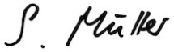

--- 
title: "Biometrics By The Border"
author: International Biometrics Society Australasian Region Conference Kingscliff,
  NSW
date: "26-30^th^ November 2017"
cover-image: "pictures/logo.png"
output: bookdown::epub_book
description: Programme and abstracts for IBS-AR Conference 2017
documentclass: book
github-repo: jmcurran/IBSAR-Prog
site: bookdown::bookdown_site
---

# Welcome {-}

Welcome to the 2017 Biometrics by the Border conference in Kingscliff, New South Wales. As we meet here on the land of the Bundjalung people, we acknowledge the traditional custodians of the land and pay our respect to the Elders past and present.

I bid a special welcome to all who travelled far from countries such as Belgium, Brazil, China, Denmark, Germany, Italy, Japan, Nigeria, South Africa, USA and Vietnam to complement the majority from Australia and New Zealand.

The conference will be opened by the current President of IBS, Elizabeth Thompson
 and closed by the incoming President, Louise Ryan. In-between, we have six outstanding keynote speakers who set the framework for an exciting and diverse scientific program. I invite you all to attend presentations on topics familiar to your research and to explore what is done in other areas. 

We have a very healthy number of students and early career researchers among the more than 120 delegates attending, indicating how popular, important and attractive data rich research continues to be in the years to come. 

This conference will be a success because of excellent work by many, in particular by Ross Darnell, Melissa Dobbie, Clayton Forknall, Alison Kelly and Bethany Macdonald, who form the local organizing committee; by James Curran (Chair of the Scientific Program), Garth Tarr and Esther Meenken who assisted James; by Warren Muller (Treasurer), David Baird (Secretary) and by Hans Hockey who is our official photographer, so always smile when he is around.

Last but not least I thank our Platinum sponsors ACEMS, GRDC and the University of Sydney for their generous financial support, many aspects of the conference are only possible because of their help.

Samuel Mueller, President IBS-AR 

